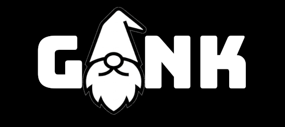

<div align="center">


</div>

GONK is an edge-native API gateway written in Go for industrial, IoT, robotics, and air-gapped environments.

It is designed for teams that need secure service exposure near devices without running a heavy control plane, a database dependency, or a full cloud gateway stack.

**Status:** community preview. The core gateway, auth, routing, load balancing, and observability features are in place; production hardening, benchmark coverage, and operator tooling are the next priority.

## Why GONK

- Single Go binary plus YAML configuration.
- Security primitives close to the edge: JWT, API keys, mTLS, RBAC, scopes, and certificate-to-role mapping.
- Works in constrained or disconnected networks where Kubernetes, SaaS control planes, and central databases are not always available.
- Built for operational workflows: templates, validation, hot reload, health endpoints, Prometheus metrics, and a companion CLI.
- Operator guardrails: protected admin endpoints, audit logging, production secret checks, route introspection, and cache/status views.

See [docs/SECURITY.md](docs/SECURITY.md) for the security model, [docs/OPERATIONS.md](docs/OPERATIONS.md) for day-two operations, [docs/DEPLOYMENT.md](docs/DEPLOYMENT.md) for production deployment, and [docs/RELEASE.md](docs/RELEASE.md) for releases.

## Best-Fit Use Cases

- Industrial gateways exposing PLC, sensor, historian, or HMI services.
- Robotics and field-device deployments with limited compute and intermittent connectivity.
- Air-gapped environments that need local auth, routing, and traffic controls.
- Edge microservice stacks that need gateway features without a large platform footprint.

For product positioning and startup strategy, see [docs/STARTUP_BRIEF.md](docs/STARTUP_BRIEF.md).

## What's New in v1.2

**Release and Deployment**
- Ready-to-download Linux, Windows, and macOS release archives
- GitHub Container Registry image availability
- Production Docker Compose template
- systemd unit and production configuration template

## What's New in v1.1

**Authorization System**
- Role-Based Access Control (RBAC)
- JWT scope validation
- Permission matrix combining roles and HTTP methods
- Support for different identity types (devices vs users)

**mTLS Support**
- Client certificate authentication
- Certificate-to-role mapping with wildcard support
- Dual authentication modes (mTLS + JWT)

**Load Balancing**
- Multiple upstreams per route
- Four strategies: round-robin, weighted, least-connections, ip-hash
- Active health checking with automatic failover

**CLI Tool**
Complete command-line interface for configuration, JWT/certificate generation, and monitoring.

## Installation

Download ready-to-run binaries from GitHub Releases:

- Linux: `gonk_<version>_linux_amd64.tar.gz` or `gonk_<version>_linux_arm64.tar.gz`
- Windows: `gonk_<version>_windows_amd64.zip` or `gonk_<version>_windows_arm64.zip`
- macOS: `gonk_<version>_darwin_amd64.tar.gz` or `gonk_<version>_darwin_arm64.tar.gz`

```bash
# Clone and build
git clone https://github.com/JustVugg/gonk
cd gonk
make build

# Binaries will be in bin/
./bin/gonk --version
./bin/gonk-cli --version
```

Or run the published container image:

```bash
docker run --rm -p 8080:8080 \
  -v "$PWD/configs/gonk.production.yaml:/etc/gonk/gonk.yaml:ro" \
  --env-file .env \
  ghcr.io/justvugg/gonk:latest
```

## Quick Start

Run the full Docker demo:

```bash
make demo-up
make demo-token
```

Then call the protected route with the generated token:

```bash
curl -H "Authorization: Bearer <token>" http://localhost:8080/api/ping
```

See [examples/quickstart](examples/quickstart/) for the full demo with two upstream services and Prometheus.

Run the quickstart smoke test locally:

```bash
make demo-smoke
```

Generate a basic configuration:

```bash
./bin/gonk-cli init --template basic --output gonk.yaml
```

Start the gateway:

```bash
./bin/gonk -config gonk.yaml
```

Generate a JWT token:

```bash
export JWT_SECRET=change-me
./bin/gonk-cli auth jwt generate --role admin --scopes "read:api,write:api" --user-id alice --expiry 24h
```

Test with the token:

```bash
curl -H "Authorization: Bearer <token>" http://localhost:8080/api/get
```

## Configuration Examples

### Authorization with Permission Matrix

```yaml
auth:
  jwt:
    enabled: true
    secret_key: "change-me-in-production"
    validate_roles: true
    validate_scopes: true

routes:
  - name: "sensor-api"
    path: "/api/sensors/*"
    upstreams:
      - url: "http://backend:3000"
    
    auth:
      type: "jwt"
      required: true
      allowed_roles: ["technician", "engineer", "admin"]
      required_scopes: ["read:sensors"]
      
      permissions:
        - role: "technician"
          methods: ["GET"]
        - role: "engineer"
          methods: ["GET", "POST"]
        - role: "admin"
          methods: ["GET", "POST", "DELETE"]
```

This setup gives technicians read-only access, engineers can read and calibrate, and admins have full control.

### mTLS for Device Authentication

```yaml
server:
  tls:
    enabled: true
    cert_file: "/certs/server.crt"
    key_file: "/certs/server.key"
    client_ca: "/certs/ca.crt"
    client_auth: "require"

routes:
  - name: "device-data"
    path: "/api/devices/*"
    upstreams:
      - url: "http://iot-backend:3000"
    
    auth:
      require_client_cert: true
      cert_to_role_mapping:
        "CN=PLC-001": "device"
        "CN=Sensor-*": "sensor"
        "CN=Admin-*": "admin"
      
      permissions:
        - identity_type: "device"
          methods: ["POST"]
        - role: "admin"
          methods: ["GET", "DELETE"]
```

Devices can only write data, while admins can read and delete.

### Load Balancing with Health Checks

```yaml
routes:
  - name: "api"
    path: "/api/*"
    upstreams:
      - url: "http://backend-1:3000"
        weight: 70
        health_check: "/health"
      - url: "http://backend-2:3000"
        weight: 30
        health_check: "/health"
    
    load_balancing:
      strategy: "weighted"
      health_check_interval: 10s
      health_check_timeout: 5s
```

Traffic is distributed 70/30 between backends. Health checks run every 10 seconds and failed upstreams are automatically removed from rotation.

### Protecting Admin Endpoints

GONK exposes operational endpoints under `/_gonk/*` and, when enabled, `/metrics`. Protect them with an admin token and optional CIDR allowlist:

```yaml
admin:
  require_auth: true
  header: "X-Gonk-Admin-Token"
  token: "${GONK_ADMIN_TOKEN}"
  allowed_cidrs: ["127.0.0.1/32", "10.0.0.0/8"]
```

CLI commands that call admin endpoints automatically send `GONK_ADMIN_TOKEN` when it is set:

```bash
export GONK_ADMIN_TOKEN="change-me"
gonk-cli --url http://localhost:8080 status
gonk-cli --url http://localhost:8080 routes list
gonk-cli --url http://localhost:8080 cache stats
```

### Production Secret Guardrails

Set production mode to reject demo secrets such as `change-me` and `change-me-admin-token`:

```yaml
runtime:
  environment: production
```

For intentionally demo-only production-shaped examples, set `runtime.allow_demo_secrets: true`.

### Audit Logging

```yaml
audit:
  enabled: true
```

Audit logs include route, method, path, status, duration, client IP, identity type, identity, roles, and scopes.

## CLI Reference

### Server Operations

```bash
gonk -config gonk.yaml              # Start server
gonk-cli validate -c gonk.yaml      # Validate configuration
gonk-cli status                     # Check if server is running
gonk-cli health                     # Server health check
gonk-cli --url http://localhost:8080 routes list
gonk-cli --url http://localhost:8080 routes describe api
gonk-cli --url http://localhost:8080 cache stats
```

### JWT Management

```bash
# Generate token
gonk-cli auth jwt generate --role admin --scopes "read:*,write:*" --user-id alice --expiry 24h

# Validate token
gonk-cli auth jwt validate <token>

# Decode token (no validation)
gonk-cli auth jwt decode <token>
```

### API Keys

```bash
# Generate API key
gonk-cli auth apikey generate --client-id mobile-app --roles user --scopes "read:sensors"

# List configured keys
gonk-cli auth apikey list -c gonk.yaml
```

### Certificate Management

```bash
# Generate CA
gonk-cli certs generate --cn "GONK CA" --type ca --output ./certs

# Generate server cert
gonk-cli certs generate --cn "localhost" --type server --output ./certs --ca-cert ./certs/ca.crt --ca-key ./certs/ca.key

# Generate client cert
gonk-cli certs generate --cn "Device-001" --type client --output ./certs --ca-cert ./certs/ca.crt --ca-key ./certs/ca.key

# Validate cert against CA
gonk-cli certs validate --cert ./certs/client.crt --ca ./certs/ca.crt

# Show cert details
gonk-cli certs info --cert ./certs/client.crt
```

### Monitoring

```bash
gonk-cli metrics                    # Show Prometheus metrics
gonk-cli metrics --route api-v1     # Filter by route
gonk-cli cache stats                # Cache statistics with entries, bytes, hits, misses
gonk-cli cache clear                # Clear cache
```

## mTLS Demo

Run a complete certificate-chain demo with Docker Compose:

```bash
make mtls-demo
```

See [examples/mtls](examples/mtls/) for details.

### Configuration Templates

```bash
# Basic template
gonk-cli init --template basic --output gonk.yaml

# Industrial IoT template
gonk-cli init --template industrial --output gonk.yaml

# Microservices template
gonk-cli init --template microservices --output gonk.yaml
```

## Industrial IoT Example

This configuration handles a typical industrial setup with PLCs writing sensor data and engineers monitoring/controlling the system.

```yaml
server:
  listen: ":8443"
  tls:
    enabled: true
    cert_file: "/certs/server.crt"
    key_file: "/certs/server.key"
    client_ca: "/certs/device-ca.crt"
    client_auth: "request"

auth:
  jwt:
    enabled: true
    secret_key: "${JWT_SECRET}"
    validate_roles: true
    validate_scopes: true
  
  api_key:
    enabled: true
    header: "X-API-Key"
    keys:
      - key: "${DEVICE_KEY}"
        client_id: "plc-001"
        roles: ["device"]

routes:
  # Devices write sensor data using mTLS or API key
  - name: "sensor-ingestion"
    path: "/api/sensors/*"
    methods: ["POST"]
    upstreams:
      - url: "http://timeseries-db:8086"
    auth:
      require_either: ["client_cert", "api_key"]
      permissions:
        - identity_type: "device"
          methods: ["POST"]

  # Users read sensor data with JWT
  - name: "sensor-read"
    path: "/api/sensors/*"
    methods: ["GET"]
    upstreams:
      - url: "http://timeseries-db:8086"
    auth:
      type: "jwt"
      required: true
      permissions:
        - role: "technician"
          methods: ["GET"]
        - role: "engineer"
          methods: ["GET"]
    cache:
      enabled: true
      ttl: 30s

  # Only engineers can control actuators
  - name: "actuator-control"
    path: "/api/actuators/*"
    methods: ["POST", "PUT"]
    upstreams:
      - url: "http://plc-gateway:502"
    auth:
      type: "jwt"
      required: true
      allowed_roles: ["engineer", "admin"]
      required_scopes: ["write:actuators"]
    rate_limit:
      requests_per_second: 10
```

## Design Tradeoffs

| Need | GONK fit |
|------|----------|
| Run a secure gateway on an edge node with minimal dependencies | Strong fit |
| Combine JWT, API keys, mTLS, RBAC, scopes, and local policy in one config | Strong fit |
| Operate in disconnected or air-gapped environments | Strong fit |
| Manage a large multi-region cloud API platform with a hosted control plane | Not the current target |
| Require mature enterprise analytics, monetization, and developer portal features today | Not the current target |

The product wedge is intentionally narrow: secure, lightweight gateway infrastructure for edge networks where generic cloud API gateways are too heavy or operationally awkward.

## Building

Prerequisites: Go 1.21+ and Make. Docker is optional for image builds. Docker Compose v2 is required for the quickstart demo.

```bash
# Both server and CLI
make build

# Just the server
make build-server

# Just the CLI
make build-cli

# All platforms (for releases)
make build-all

# Clean
make clean

# Run tests
make test

# Full Docker Compose demo
make demo-up
make demo-token
make demo-down

# Quickstart smoke test
make demo-smoke

# Full mTLS demo
make mtls-demo
```

## Testing

GONK includes package-level Go tests for configuration loading, repository examples, JWT/API key/mTLS auth, cache behavior, rate limiting, request/response transforms, health endpoints, circuit breaker state transitions, load balancing, and HTTP proxy routing.

```bash
make test
make test-coverage
make test-race
```

Before publishing a release, run coverage, the race detector, binary builds, and the Docker image build locally. See [docs/TESTING.md](docs/TESTING.md) for the current coverage focus and remaining test gaps.

On Windows without make, use Go directly:

```cmd
go build -o bin\gonk.exe .\cmd\gonk
go build -o bin\gonk-cli.exe .\cmd\gonk-cli
```

## Project Structure

```
gonk/
├── cmd/
│   ├── gonk/          # Server binary
│   └── gonk-cli/      # CLI tool
├── internal/
│   ├── auth/          # Authorization (RBAC, scopes, mTLS)
│   ├── loadbalancer/  # Load balancing strategies
│   ├── config/        # Configuration loading
│   ├── server/        # HTTP server
│   ├── proxy/         # Proxy handlers (HTTP/WS/gRPC)
│   ├── cache/         # Response caching
│   ├── metrics/       # Prometheus metrics
│   └── middleware/    # Rate limiting, logging, etc
├── configs/           # Example configuration
├── docs/              # Product and strategy docs
└── Makefile
```

## License

Apache License 2.0

## Acknowledgments

This version was driven by feedback from industrial IoT users who needed lightweight authorization capabilities. Thanks to the Go ecosystem libraries that make this possible: Gorilla Mux, JWT-Go, Prometheus client, and others.

